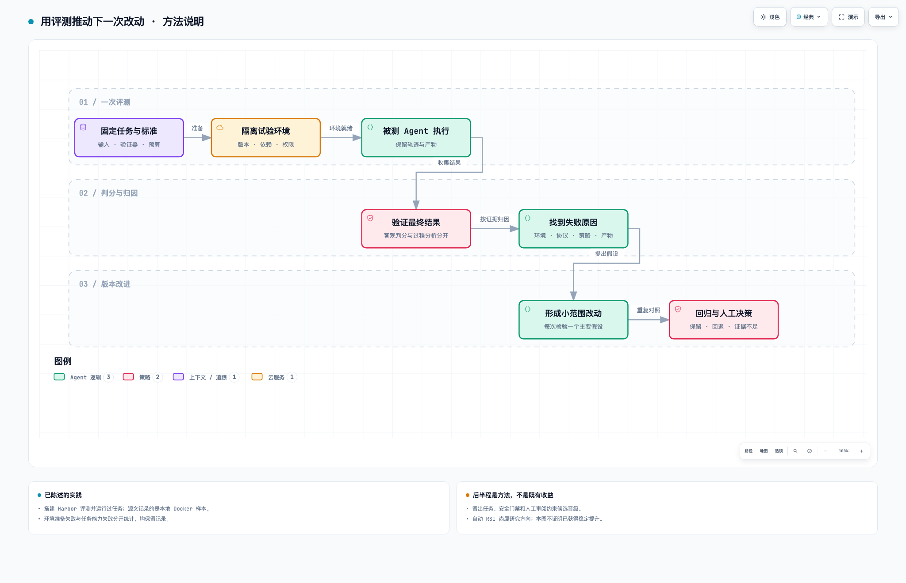

# Harbor 评测：怎样证明 Agent 真的变好

依据：[本人陈述与已有评测笔记的边界](sources/会话摘要.md)、[Harbor 文档](https://docs.harborframework.com/)。做过评测任务是实践陈述；本章完整流程是方法整理，不宣称每个环节已规模化运行。

## 问：为什么不能只试几个演示任务？

模型、工具、上下文或环境变化，可能让某个演示变好，却让其他任务退化。评测要把输入、执行环境、输出和验收规则固定下来，让不同版本接受可比较的检验。

总分只是入口。需要知道什么类型的问题变化了，是系统真正更可靠，还是环境、预算和任务选择变了。

## 一次 trial 怎样走完？



图 3：前半段对应任务评测链路，后半段是持续改进方法，不代表已经自动实现 RSI。[交互图，下载后打开](assets/evaluation-loop.html)。

任务定义给出目标和输入，环境提供隔离工作区，被测 Agent 通过适配器执行。保存轨迹与产物，运行独立验证逻辑，再汇总结果和清理资源。

沙箱平台可以提供环境，但要补齐创建、就绪检查、执行、文件传输、超时、日志、验证与清理的适配。不能因为有一个 create API 就宣称适配完成。

每次试验使用独立状态，固定或记录镜像、依赖、网络、权限、模型版本、工具版本和预算。验证器的材料与答案不应提前泄漏给候选 Agent。

## 问：哪些失败要分开统计？

| 分类 | 例子 | 应得出的结论 |
| --- | --- | --- |
| 环境/准备失败 | 镜像拉取、安装依赖、代理连接失败 | 端到端任务不可用，但未必测到模型能力 |
| 执行框架失败 | 工具协议不兼容、状态异常 | 先检查适配与 Harness |
| 任务能力失败 | 执行完成，但产物不满足要求 | 分析推理、上下文、工具策略 |
| 安全失败 | 未获授权的外部写入 | 独立阻断，不能用任务通过抵消 |
| 验证器失败 | 判分程序异常或数据缺失 | 结果无效/待复核，不能默认失败或通过 |
| 预算耗尽 | 达到时间或 Token 限额 | 记录部分成果和触发原因 |

已有材料描述过“准备阶段失败、尚未进入任务”的样本。它应进入端到端可用性统计；分析完成任务的能力时，另报告具备有效执行条件的分母，不能静默删除。

## 问：怎样让比较公平？

基线和候选使用相同任务、预算、版本条件和尽可能可比的环境。重复运行并报告波动；改动前先定义要优化的指标和不可退化项，避免跑完再挑有利结果。

至少记录任务通过率、端到端失败率、总耗时、输入输出 Token、工具调用量、沙箱驻留、危险动作和人工返工。没有执行的任务、超时和基础设施故障都保留。

一次 trial 成功只能证明这一次的链路与结果，不代表整个任务集的成功率。没有硬件/负载条件的 tokens/s 不适合横向比较。

## 问：让模型当裁判可以吗？

可用于开放式质量和过程分析，但要有明确评分准则，用人工样本校准，保留证据片段，关注偏置和不一致。存在可执行验证器时，不随意用模型的“看起来不错”覆盖客观失败。

验证器独立不等于执行环境安全。需要限制候选 Agent 修改判分逻辑、接触答案或污染结果文件。

## 问：怎么从评测变成持续改进？

选择一类可复现失败，提出一个主要原因假设，只改必要因素，然后跑回归与未参与调参的留出任务。收益成立才形成新版工具反馈、Skill、上下文策略或运行时逻辑。

“用户使用得更多”不会自动令系统更好。要先获得反馈使用授权、清理敏感信息，再把失败变成有输入、标准和证据的用例。

## 最小评测记录

### 已核对的两个本地样本

2026-10-08 核对了两份已有结果与成功样本的 verifier 输出，并保存[脱敏证据](sources/Harbor样本核对.md)。不是本轮重新运行的结果。

| 样本 | 记录中的结果 | 对工程判断的帮助 |
| --- | --- | --- |
| OpenSSL 自签证书任务 | 本地 Docker；6 项测试通过，reward 1.0 | 证明该次安装、执行、收集与判分链路跑通 |
| fix-git 任务 | 安装阶段网络异常；没有 Agent 执行与判分结果 | 环境失败要保留，但不能归为模型任务能力失败 |

成功样本用的是 deepseek-harness 0.1.2-rc.1，模型记录名称为 gpt-5.6-sol，不能混淆 Harness 与模型身份。总耗时约 362 秒，其中准备约 170 秒、执行约 178 秒；这些时间来自单次阶段记录，不是平均值或 P95。它提示应先看安装与执行分别占多少，再决定优化位置。

这些本地 Docker 样本也不证明已经在平台沙箱完成适配。远端接入应另外做同任务的执行、文件、验证与清理对照。完整失败归因、受保护判分环境与规模化回归仍需独立验收。

### 后续记录模板

```text
任务/数据版本：
Agent 与模型版本：
环境/镜像/权限：
基线、候选及改动假设：
预算与重复次数：
有效 trial、环境失败、任务失败：
指标定义与结果：
关键证据：
结论：保留 / 回退 / 证据不足
```

## 面试怎样讲得像做过？

先说为什么建立评测，再讲一条完整 trial，随后讲一个失败分类和一个由证据推动的改动。没有原始日志时不报精确收益，没跑过的环境不说已经验证。

向 AI 测试开发迁移，可以进一步用 Agent 分析失败轨迹、提出复现与回归候选；但 [评测 Agent 与 AI 测试工具](09-面试与职业选择.md)仍是不同工作。
