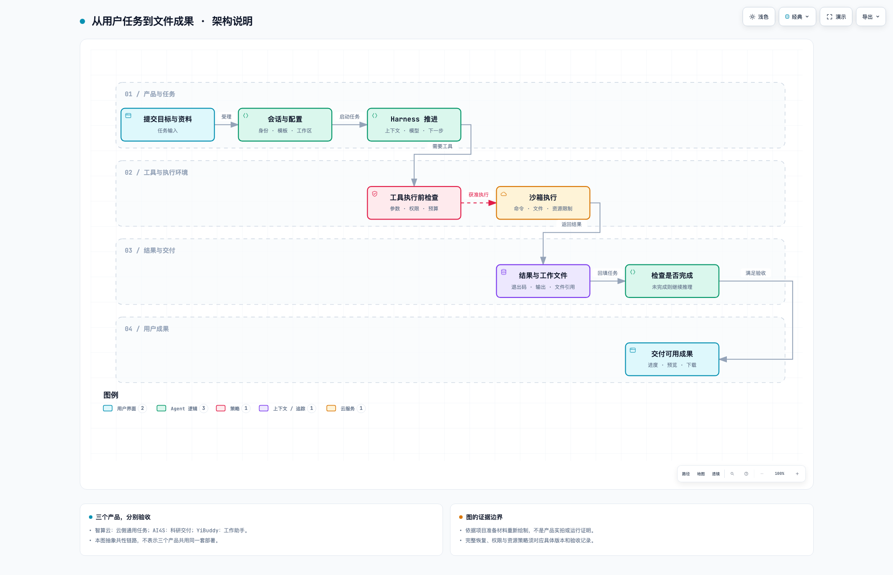

# 三个产品，一条工程主线

先分清产品，再解释共性技术。智算云、AI4S 和 YiBuddy 是产品；上下文、恢复、预算、评测是技术专题，不能讲成七八个平行项目。

| 产品 | 用户真正要什么 | 阅读入口 |
| --- | --- | --- |
| 智算云 | 把任务交给云端，查看执行过程，取回成果 | [云侧 Agent 服务](智算云.md) |
| AI4S | 用专业资料和工具完成有来源、有方法依据的科研任务 | [科研垂类交付](AI4S.md) |
| YiBuddy | 在工作助手里连续使用资料、工具和成果，并控制执行 | [工作型 Agent](YiBuddy.md) |

经历时间线见[个人主线](../01-项目与个人主线.md)。表格按产品组织，不代表任职先后；技术复用要落实到模块、协议和版本，不能只凭一张图判断。

## 用一条任务解释架构

图 1：依据准备材料抽象的共性链路，**不是产品截图，也不证明全部能力已上线**。图中画一次执行经过；需要继续时，结果回到下一轮上下文。取消、超时和恢复另见技术专题。[交互图，下载后打开](../assets/task-delivery.html)。

读图时只抓三处交接：目标怎样成为任务；工具意图怎样成为实际命令；执行结果怎样成为用户拿得到的文件。每处都需要接口、状态和验收条件。

## 每个项目保持相同叙事

1. 用户场景：为什么需要这个产品。
2. 一条完整任务：输入、运行过程、成果。
3. 架构选择：边界为什么这样划。
4. 个人责任：设计、编码、联调分别做了什么。
5. 完成阶段与证据：规划、代码、验收、生产效果分别确认。

项目实图和测试结果的补充位置见[证据清单](../interview/03-事实边界与证据.md)。后续优先补能够证明一次完整交付的材料，不堆首页截图。
