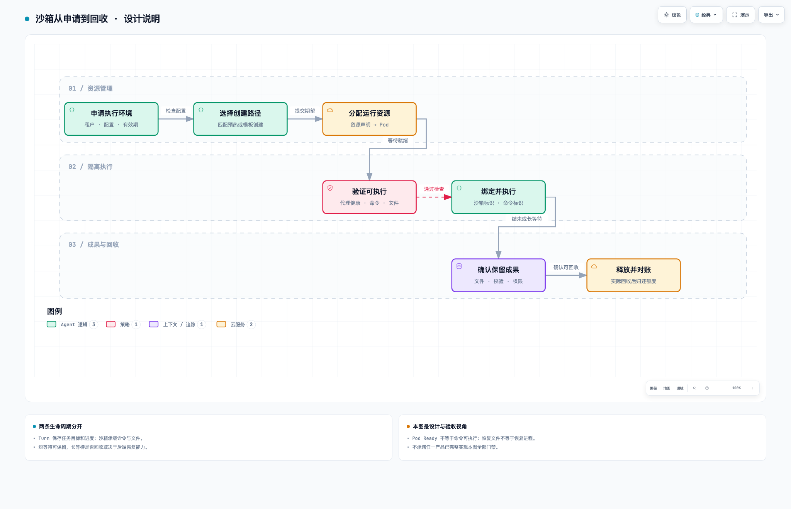

# 沙箱创建：从资源申请到真正可执行

[沙箱总论](../05-沙箱与执行资源.md) · [命令、文件与恢复](02-命令文件与恢复.md)

## 先看一次完整资源生命周期

图 2：按来源材料提炼的设计与验收视角，不是现网部署图。条件分支在下文展开，不承诺现有后端都具备暂停或完整恢复能力。[交互图，下载后打开](../assets/sandbox-lifecycle.html)。

## 1. 为什么不是创建一个 Pod 就结束

模型请求运行脚本，产品需要的结果是一个可使用的环境：身份正确、工作区明确、命令和文件接口可用、占用有期限、失败能解释。Pod 只承载其中的计算部分。

直接调用 Kubernetes 可以创建资源，但平台仍需提供沙箱身份、命令和文件协议、访问控制、租期与清理。复用沙箱协议和 Controller 的价值在这里，不是给容器换一个名字就更安全。

## 2. 五种对象分别回答什么

| 对象 | 对应问题 | 易混淆处 |
| --- | --- | --- |
| Environment / 环境模板 | 要用什么镜像、资源、挂载和启动方式 | 配置不是正在运行的实例 |
| Pool / 预热池 | 提前留多少可分配资源 | 预热目标不等于当前可用量 |
| BatchSandbox / 资源声明 | 集群应创建或分配哪些沙箱成员 | 它的副本不等于 API 或模型副本 |
| Sandbox / 业务实例 | 用户怎样查询和操作这次环境 | 业务记录不等于资源已经就绪 |
| Pod / 执行载体 | 实际计算在哪里发生 | Running 不等于命令接口可用 |

这是来源材料使用的命名，其他平台未必相同。一次会话可以连续使用绑定的同一个实例，不应默认每次工具调用都创建 Pod。

## 3. 从请求到首次命令

平台读取模板并合并允许的覆盖配置，检查权限与容量，再选预热或新建路径。Controller 根据资源声明分配或创建 Pod。执行代理准备好后，还需要检查工作区和最小命令，最后才把实例当作可执行环境使用。

把以下里程碑分开记录：请求受理、资源声明提交、调度成功、镜像准备、容器启动、执行代理健康、首次命令成功。只测创建接口耗时，可能把最耗时的部分全部留给下一次工具调用。

就绪检查应选不会产生危险副作用的最小操作，例如在专用临时目录读写再清理。它证明基本执行链路，不等于证明所有业务依赖已安装。

## 4. 预热命中有两道门

首先是配置兼容。镜像一样但挂载、权限或资源不同，不能直接复用。其次是当下有空闲、健康、适合分配的实例。配置匹配但池里没资源，仍可能等待或冷启动。

还要区分“从未分配的预热实例”和“被其他任务使用过的实例”。后者涉及进程、文件、凭据和网络连接残留；没有可靠重置和隔离验证，不应直接交给下一个租户。

预热把准备成本提前支付，换来空闲占用。衡量它至少看申请到首次成功命令的 P95、命中率、空闲成本和残留检查，不只看池中 Pod 数。

## 5. 为什么需要状态对账

平台业务库与 Kubernetes 通常不是同一个事务。资源提交成功、业务记录却未确认时，简单重试可能重复创建；删除请求受理后，实际资源也可能尚未释放。

一种设计是先保存稳定操作 ID、参数摘要与确定性资源名；提交资源后记录 UID/版本。恢复扫描根据操作记录查询已有资源，再补状态或继续，而非直接再建一份。同一幂等键改变配置应冲突，不复用错误实例。

这个方案是可验证的工程方法，本库没有把内部某个版本的具体缺口公开，也不宣称方案已全部实现。对账还要处理终态不能被旧事件写回运行中，以及确实释放后再归还额度。

## 6. 最小验收矩阵

| 场景 | 观察对象 | 应验证的不变量 |
| --- | --- | --- |
| 模板创建与预热命中各跑一次 | 代理、命令、文件 | 两条路径提供相同必要接口 |
| 受理后客户端重试 | 操作 ID、实际资源数 | 不额外创建相同逻辑实例 |
| 控制面在提交窗口重启 | 业务状态与集群对象 | 可以对账，不永久悬挂 |
| 请求删除后访问 | 访问状态、实例、配额 | 权限与资源按约定收敛 |
| 并发达到上限 | 预占、拒绝、实际实例 | 不靠非原子读数宣称严格配额 |
| 回收后再分配 | 工作区与凭据 | 不继承上一个任务的内容 |

这些是验收要求，不是已全部通过的报告。生产可用性必须用具体环境和版本验证。
